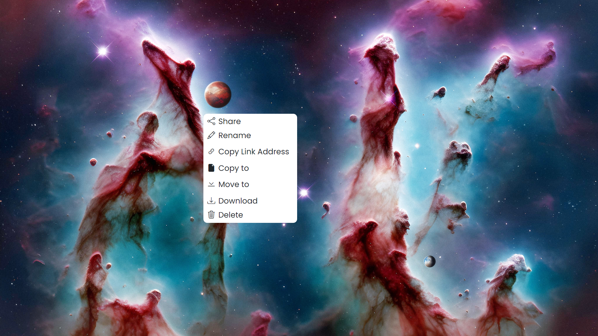

# **Custom Context Menu**

### Don't waste your time building Context Menus for websites from the ground up | Fork and enjoy

### I made the code clean as possible so you can easily use and change anything you want. Read bottom description

### Check it live [here](https://iwbtfy.github.io/ContextMenuTemplate/).

---

## Features :

### Pop up where ever you right-click on the page.

- ### Requires no refresh.
- ### Easy to use
- ### You can exit from the menu py pressing 'ESC' or "LClick"

### CSS:

- Has root so you can add or change colors very fast

### Javascript:

- Commented so you know what is what

### HTML:

- Clean Coded
- bootstrap 5 CND for making stuff easy
- Bootstrap icons CDN for Icons.

---

### I don't think this repo is great or even good I just want to be serious about consistency and how committed to learning and this is the one way to keep it together and improve I don't believe in Practice makes prefect it only makes better and by a lot of it you become Great. Thanks for your time hope it helps

---

# Template Images:

